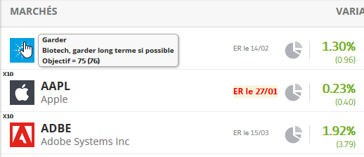

## myEtoro
**Ajout de fonctionnalités et d'informations à Etoro via un userscript**

** English version here : [readme.md](readme.md)**

- [Pourquoi ce script?](#Pourquoi?)
- [Comment cela fonctionne?](#Comment?)
- [Comment installer?](#Installation)
- [Exemples de fonctionnalités](#Quoi??)
- [Nouvelles fonctionnalités : Feuille de route](#Feuille de route)

## Pourquoi?
Utilisant Etoro, je trouve qu'il manque pas mal de choses à leur interface.
Eotor ne semble pas vraiment dans une démarche Agile (déjà, pas de possibilité de faire des suggestions d'évolution de leur interface; et leur API n'est pas réellement existante...).
Donc plutôt que de me plaindre, j'ai mis la main à la pâte....
Dans ma Todo list :
- Pouvoir annoter les actions (pénible de devoir jongler avec des notes à part), ces notes devant être visible partout!
- Mise en avant des marchés (Surveillance ou actions à faire rapidement par exemple)
- Ajout d'informations : date des résultats (earning reports), variation avant l'ouverture (pré-market),...
- Sur le portefeuille, voir directement l'évolution journalière pour chaque marché
- Pouvoir copier le texte! (sur les performances des traders surtout, pour les copier et les analyser dans une feuille à part)
- Trier le portefeuille ou les favoris pour ne voir que les marchés ouverts (le genre de truc qu'Etoro devrait intégrer par défaut!)
- etc
Ce script devrait répondre à la plupart de ces besoins. 

## Comment?
Le script récupère les informations dans une feuille de calcul Google (cela permet un accès de partout, et surtout que chacun puisse héberger ses propres données facilement... dans un précédent script, j'hébergeais tout : plus simple pour les utilisateurs mais ça pose d'autres soucis).
Suivant la page d'Etoro détecté, le script injecte simplement les données de la feuille. Tout simple ;-).

## Installation

 1. Copier le code dans un userscript via TamperMonkey/GreaseMonkey 
 2. Créer une feuille de calcul Google avec les titres de colonnes suivantes :
	- **NAME**: noms des marchés tel qu'affichés dans Etoro (COPPER, BTC, AAPL, STM.MI,...)
	- **ER**: dates des rapports (qu'il faudra renseigner manuellement pour l'instant)
	- **ALERT**: Si on y mets un "x", le nom du marché sera mis en gras/rouge dans Etoro 
	- **LEVERAGE**: Indicateur d'un levier important 
	-  **TODO** : Action à faire (e. g. : Acheter, Vendre, Surveiller...); Apparait dans les notes et permet de filtrer par action
	- **OUT**: Si vous voulez note le prix de sortie (par exemple pour revenir à un meilleur prix) 
	- **TARGET**: Votre prix ciblé
	- **ESTIMATE**: Consensus sur le prix (à renseigner manuellement, pas mieux pour l'instant)
	- **NOTE**: Ce que vous voulez...  j'y mets mes analyses (résistance par exemple), et les actions à faire (suivre tel ou tel chose, etc) 
	- **TYPE**: US/EU/MAT/CR, permet de filtrer par type de stock (par exemple, pour filtrer pour ne voir que les marchés ouverts... EU+MAT+CR le matin en France ;-) )
	- Les colonnes sont (normalement) non obligatoires, utilisez celles que vous voulez. Si un stock n'est pas présent ou pas complété, le script ne fera tout simplement rien pour celui-ci.
	
	Le feuille ressemble à ça :
	
 3. Commencez à compléter les stocks qui vous intéressent.
 4. Partager la feuille via un lien et notez ce lien.

5. Dans le code, tout en haut:
	- noter ce lien dans la variable **idSpreadsheet**
	- noter le nom de la feuille (onglet) dans la variable **SheetName**

6. Activer le script sur Etoro dans TamperMonkey/GreaseMonkey  :simple_smile:

## Quoi??
Quelques captures d'écrans pour illustrer...

... Alertes (noms en rouge), leviers importants (tag X10), notes dans les bulles quand la souris passe sur le logo d'un stock, dates de rapports (ER)
 

... idem sur la page d'un stock

... filtres par type de marché (type ou US/EU), vous pouvez afficher plusieurs marchés en même temps (utile pour voir ceux ouverts, ex : EU + CRYPTO + MATERIALS à 10h GMT)
Cliquer pour en choisir un; CTRL+click pour en choisir plusieurs en validant via OK

... filtrer par action (dynamique dans la dernière version, mettez les actions que vous voulez!)

... exporter l'historique du portefeuille

... date des résultats sur les favoris

## Feuille de route

**TODO**
-  [ ] Information dynamique sur le "spread"
-  [ ] Récupérer dynamiquement le consensus
-  [ ] Récupérer dynamiquement les dates de résultats (ou plus facilement que la saisie manuelle dans la feuille)
-  [ ] Afficher dynamiquement la variation journalière sur le portefeuille
	- ... pour celui-là, je ne sais pas comment faire (sans avoir à spammer ou payer l'API d'un autre site)

**FAIT**
- Meilleurs filtres sur les portefeuille/favoris 
	- [X] *(26/12/2017)* Les filtres Actions et Types marchent simultanément (ex : voir les stocks "US" marqués à "Vendre")
	- [X] *(08/01/2018)* Les filtres sont enregistrés pour la session (ex : permet d'ouvrir un stock puis revenir en arrière sans perdre le filtre actif)
	- [X] *(17/01/2018)* Le filtre action est maintenant dynamique, permettant d'ajouter ce que vous voulez (pas forcément des actions d'ailleurs... ex : Ajouter un "Surveiller SL" si nécessaire...)
-  [X] Voir les G/P par type de stocks (marre d'être polluer par les mouvements des crypto...)
-  [X] Voir les dates des résultats sur les favoris (indispensable en période de résultats!)