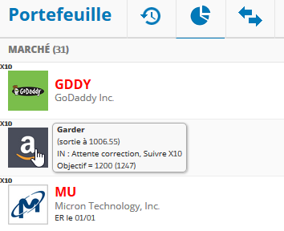
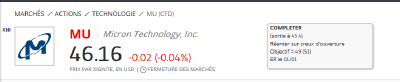
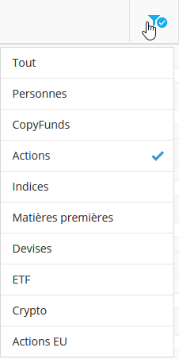

# myEtoro
Add functionnality &amp; data to Etoto with an usercript

# Why
Using etoro lately, I find that things are missing in their interface. 
Etoro really doesn't seem to be in an Agile process (already, no possibility to make suggestions and little improvement of the interface)
So either I complain or I find a solution.... 
In my todo list:
- To be able to annotate the actions (penile of having to juggle with notes apart), see these notes everywhere.
- Highlight markets (monitoring or actions to be taken quickly, for example)
- More info: date of earnings reports, variation in pre-marketing
- On the portfolio, see directly the daily evolution of the market 
- The ability to copy text! (especially the performance of the traders, for analysis in a separate sheet before copying them if necessary)
- Sort my portfolio or favourites to see only open markets
- etc
The script answers most of them. 

# How
.. à refaire suite plantage...

# Install
Copy the code into a new GreaseMonkey userscript
Create a Google sheet with the titles of the following columns:
- NAME: names of the markets such as display in Etoro (COPPER, BTC, AAPL, STM. MI,...)
- ER: dates of earning reports
- ALERT: if you put a cross, the name of the market will be highlighted in Etoro
- LEVERAGE: for a strong lever indicator 
- OUT: if you want to indicate the price you've paid (to get back to a better price for example; -))
- TARGET: your price target
- ESTIMATE: price consensus
- NOTE: what you want... I write down my analysis (resistance for example) and the action to be taken (guidance for example)
- TYPE: US/EU/MAT/CR, allows to filter the markets (to see only open markets for example)
Columns are (normally) not mandatory, use the ones you want. If a market is not present or poorly rated, the script will simply not do anything about it.

Sheet look like this :

Start rating the markets you are interested in.
Share your sheet and note the sharing link.

In the code:
- note this link in the variable idSpreadsheet
- note the name of your sheet in SheetName

Activate the script on Etoro :).

# What??
Some screenshot snapshots to illustrate...

... Alerts (red name), high leverage (x10 tag), notes in popup when mouse hover market logo, ER date
 

... same on market page

... filter by place (clic to hide US markets... I use it when US is closed to see only open markets... but I must improve it)

